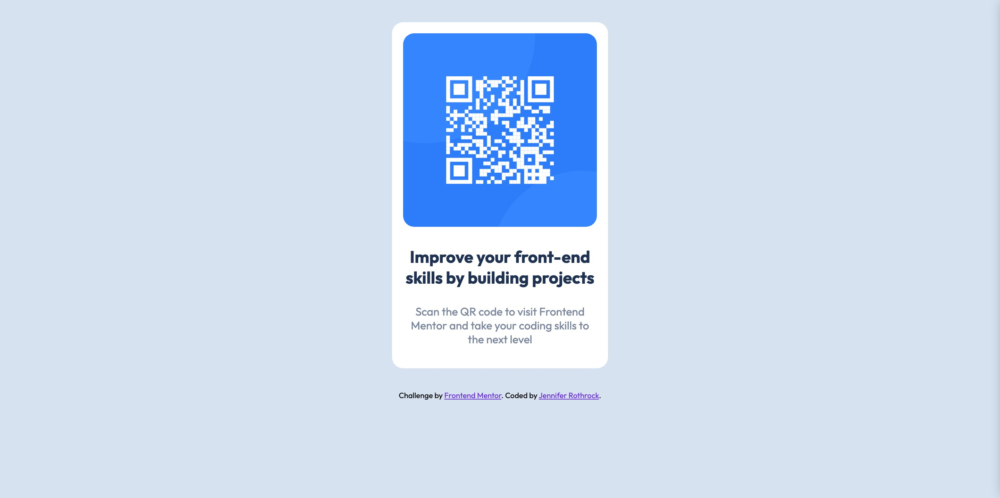

# Frontend Mentor - QR code component solution

This is a solution to the [QR code component challenge on Frontend Mentor](https://www.frontendmentor.io/challenges/qr-code-component-iux_sIO_H). Frontend Mentor challenges help you improve your coding skills by building realistic projects. 

## Table of contents

- [Overview](#overview)
  - [Screenshot](#screenshot)
  - [Links](#links)
- [My process](#my-process)
  - [Built with](#built-with)
- [Author](#author)

## Overview
Page container parent div, with content-container div for QR code image and bold/regular text below.

### Screenshot

### Links

- Solution URL: [qr-code-component]
(https://qr-code-component-rothrock.netlify.app)

## My process
I start with mobile-first HTML content. Then I define the CSS. I start working on the outermost div inward and work until the layout looks the way I want it to. I do the individual details last, font, colors, etc.

I use CSS custom properties as much as possible, setting them up in the root of the project.
This means that if I want to change a property, for example a color or a font; I only
have to change the variable in the root and all the instances are updated.

The last task is responsive views for tablet and desktop.

### Built with

- Semantic HTML5 markup
- CSS custom properties
- Flexbox
- Mobile-first workflow
- @font-face rules w/ Outfit google font

## Author

- Website - [Jennifer Rothrock]
(https://rothrock-portfolio.netlify.app/)
- Frontend Mentor - [@jeniverede]
(https://www.frontendmentor.io/profile/jeniverede)

