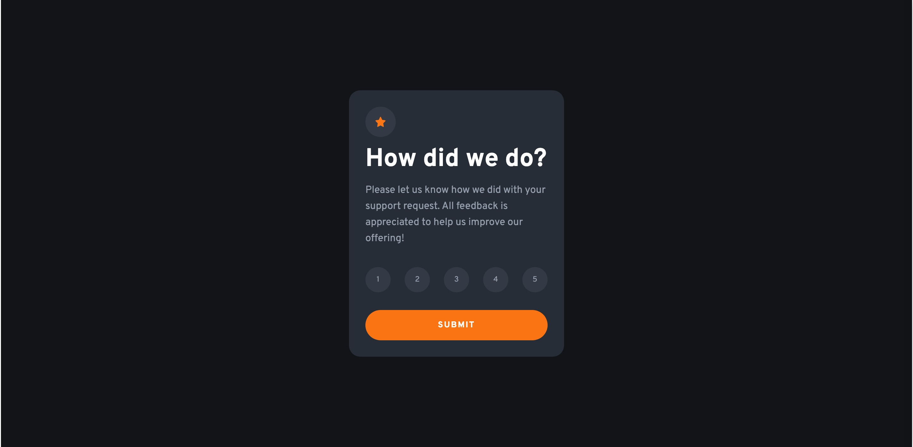

# Frontend Mentor - Interactive rating component solution

This is a solution to the [Interactive rating component challenge on Frontend Mentor](https://www.frontendmentor.io/challenges/interactive-rating-component-koxpeBUmI). Frontend Mentor challenges help you improve your coding skills by building realistic projects. 

## Table of contents

- [Overview](#overview)
  - [Screenshot](#screenshot)
  - [Links](#links)
- [My process](#my-process)
  - [Built with](#built-with)
- [Author](#author)

## Overview

### Screenshot

### Links

- Github repository: [rating-component]
  (https://github.com/jeniverede/frontend-mentor-projects/tree/main/rating-component)

- Netlify URL: [rating-component-rothrock]
  (https://rating-component-rothrock.netlify.app/)

## My process

I start with mobile-first HTML content. Then I define the CSS. I start working on the outermost div inward and work until the layout looks the way I want it to. I do the individual details last, font, colors, etc.

I use CSS custom properties as much as possible, setting them up in the root of the project.
This means that if I want to change a property, for example a color or a font; I only
have to change the variable in the root and all the instances are updated.

The last task is responsive views for tablet and desktop.

### Built with

- [React](https://reactjs.org/) - JS library (You need to have npm installed in order to view the project, npm install, then npm run dev)
- Semantic HTML5 markup
- CSS custom properties
- Use of Flexbox
- Mobile-first workflow, media query
- @font-face rules w/ Overpass Google font

## Author

- Website - [Jennifer Rothrock]
  (https://rothrock-portfolio.netlify.app/)
- Frontend Mentor - [@jeniverede]
  (https://www.frontendmentor.io/profile/jeniverede)
